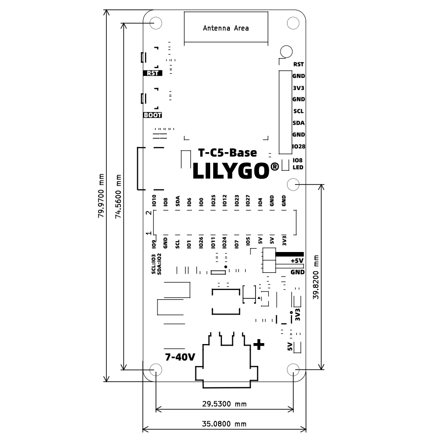
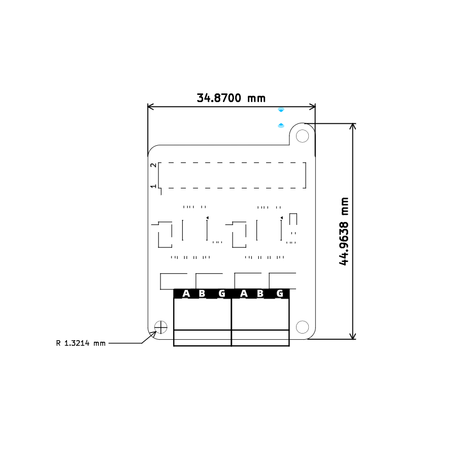
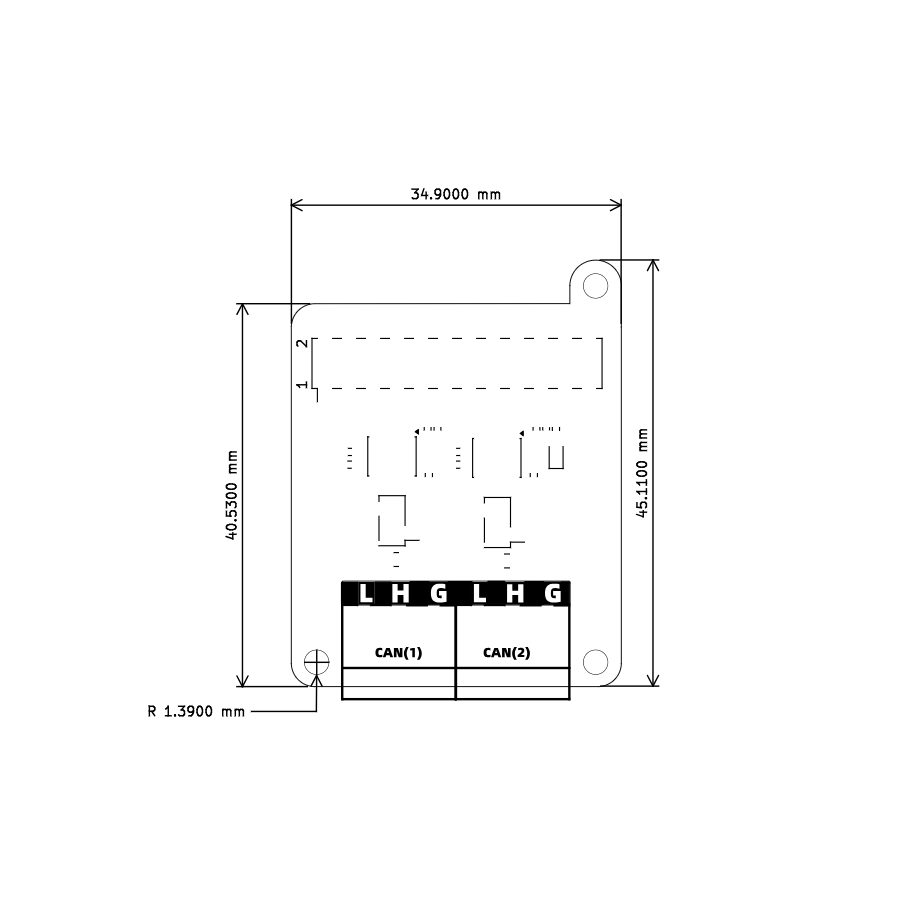

# T-C5-Base

- [T-C5-Base SVG](./T-C5-Base.svg)
- [T-C5-Base DXF](./T-C5-Base.dxf)

# T-C5-Rs485-Shield

- [T-C5-Rs485-Shield SVG](./T-C5-Rs485-Shield.svg)
- [T-C5-Rs485-Shield DXF](./T-C5-Rs485-Shield.dxf)

# T-C5-Can-Shield

- [T-C5-CAN-Shield SVG](./T-C5-CAN-Shield.svg)
- [T-C5-CAN-Shield DXF](./T-C5-CAN-Shield.dxf)

